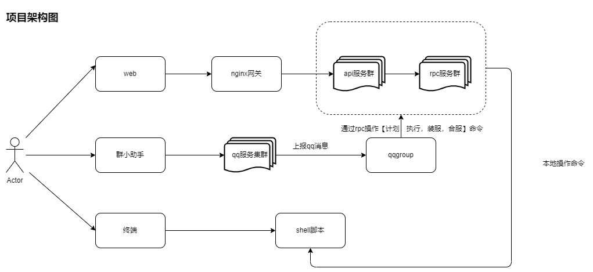

# 此后端基于go-zero框架 ywadmin-v3 运维管理系统

## 一、常用快捷命令
### 1、通过ddl生成快速生成CURD代码
goctl model mysql ddl --src="./*.sql" --dir="./"

### 2、生成zrpc
goctl rpc protoc admin.proto --go_out=. --go-grpc_out=. --zrpc_out=.

### 3、生成swagger
goctl api plugin -plugin goctl-swagger="swagger -filename admin.json" -api admin.api -dir .

goctl api plugin -plugin goctl-swagger="swagger -filename yunwei.json" -api yunwei.api -dir .

### 4、生成api
goctl api go -api admin.api -dir .

### 5、生成docker
goctl docker -go admin.go

## 二、后端接口功能进度,待完善...

### 1.系统模块
#### 1.1系统管理
- [x] 策略（数据权限控制）
- [x] 策略组（前端展示）
- [x] 角色（菜单权限控制）
- [x] 菜单（菜单展示）
- [x] 用户
- [x] 用户组
- [x] 部门
- [x] 字典（全局）
- [x] 公司
- [x] 项目（全局）
- [x] 标签（全局）
- [x] 标签组
- [x] 搜索（全局）

#### 1.2日志管理
- [x] 登录日志
- [x] 操作日志

### 2.运维模块
#### 2.1资产管理
- [x] 资产信息
- [x] 秘钥信息
- [x] WebSSH

#### 2.2运维管理
- [x] 服务器信息
- [x] 功能服信息
- [x] 游戏服信息
- [x] 集群管理
- [x] 平台管理

#### 2.3任务管理
- [x] 操作队列
- [x] 操作日志
- [x] 装服日志
- [x] 待装列表
- [ ] 待合列表
- [ ] 待迁列表
- [x] 任务队列(计划安排的装、合、迁、清理、回收队列)

#### 2.4运营管理
- [x] 维护计划
- [x] 合服计划
- [x] 开服计划

#### 2.5帮助中心
- [x] 格式化工具
- [x] 操作文档

### 3.内网管理
- [x] 编译前端
- [x] 编译后端
- [x] PHP更新
- [x] 代理主机
- [x] 装服计划
- [x] 版本管理
- [x] 服务器管理
- [x] 项目集群管理

### 4.小助手管理
##### 4.1群组的功能
- [x] 关键字处理（比如：帮助文档）
- [x] 回复的操作（比如：执行，装服，计划）

##### 4.2讨论组的功能
- [x] 关键字处理（比如：每日新闻，每日疫情，合服计划等功能）